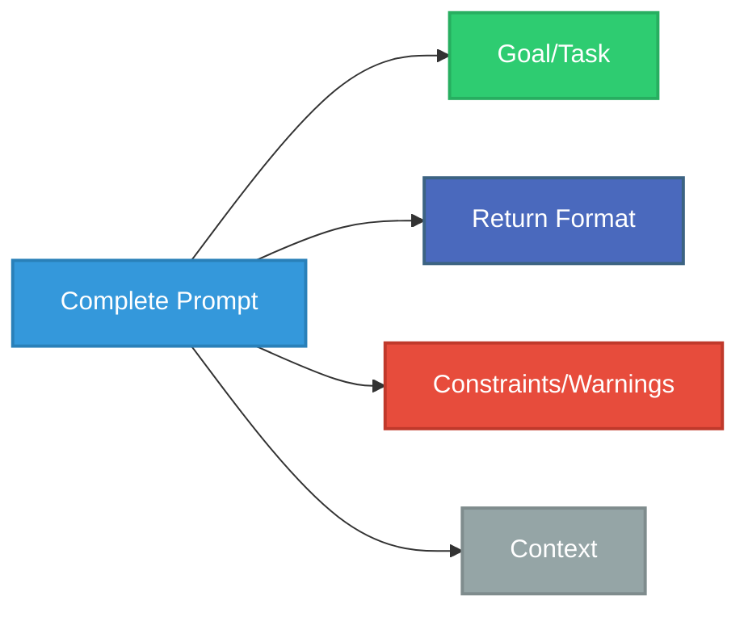
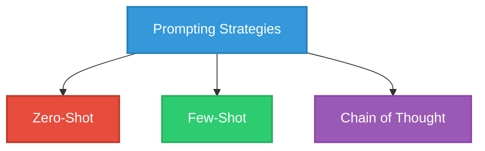
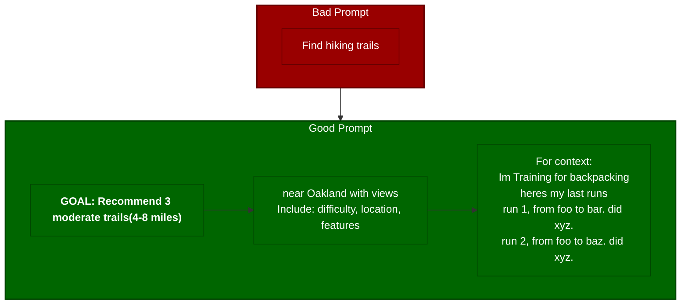
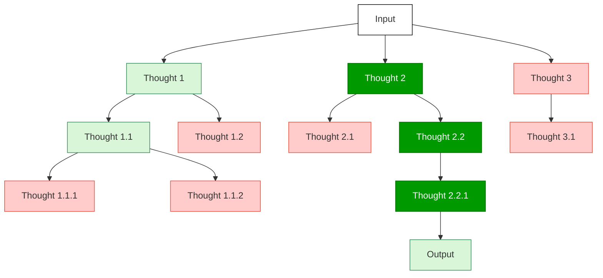

# Prompt Engineering Cheatsheet 📝

## Anatomy of a Prompt



| Component | Purpose | Example |
|-----------|---------|---------|
| **🎯 Goal/Task** | Define what you want | "List 3 medium-length hikes near SF with unique views" |
| **📋 Return Format** | Specify output structure | "For each: name, location, distance, time, features" |
| **⚠️ Warnings** | Prevent errors | "Verify trail names and ensure they're currently open" |
| **🌐 Context** | Add background info | "I'm an intermediate hiker who prefers less crowded trails" |


### Example
> Source: @benhylak on x


## Prompting Strategies



### Zero-Shot vs. Few-Shot

| Zero-Shot | Few-Shot |
|-----------|----------|
| No examples provided | Provides examples first |
| "Recommend a hiking trail near SF with ocean views" | "Criteria: Family trail, Marin County<br>Answer: Muir Woods...<br><br>Criteria: Dog-friendly, waterfalls<br>Answer: Alamere Falls...<br><br>Criteria: Panoramic views, transit access<br>Answer: ?" |
| Simple but less specific | More verbose but better pattern matching |

### Chain of Thought (CoT)

| Type | Description | Example |
|------|-------------|---------|
| **Zero-Shot CoT** | Add "Let's think step by step" | "What's the best hiking trail for seeing wildflowers in April? Let's think step by step." |
| **Few-Shot CoT** | Show reasoning process examples | "Question: Best dog-friendly trail?<br>Reasoning: 1) Check dog policies 2) Find appropriate length...<br>Answer: Waterfall Loop Trail" |

## Basic vs. Optimized Prompts



## Advanced Techniques: Tree of Thoughts



| Prompting Method | Description | Good For |
|-----------------|-------------|----------|
| **Input-Output** | Direct prompting | Simple, straightforward tasks |
| **Chain of Thought (CoT)** | Single reasoning path | Step-by-step problems |
| **Tree of Thoughts (ToT)** | Multiple reasoning paths | Complex problems requiring exploration |

### How ToT Works
- Generate **multiple thought branches** from the input
- **Evaluate each branch** to determine which is promising (green) vs. dead-end (pink)
- **Explore promising paths** further while abandoning others
- Continue **branching and evaluating** until reaching a solution
- Uses **search algorithms** (breadth-first/depth-first) to explore the tree

### Example ToT Prompt

```
Imagine three different hiking experts are answering this question.
All experts will write down 1 step of their thinking, then share it with the group.
Then all experts will go on to the next step, etc.
If any expert realizes they're wrong at any point, they leave.

The question is: What's the best 3-day backpacking route in Yosemite for someone training for a longer trek?
Consider elevation gain, camping options, water sources, and scenic value.
```

## Optimization Tips

- ✅ **Be specific**: Clear criteria, measurable targets
- ✅ **Structure output**: Define format, use bullet points
- ✅ **Chunk information**: Organize in clear sections
- ✅ **Add context**: Include relevant preferences/background
- ✅ **Use patterns**: Test cases, expert perspectives, step-by-step format
- ❌ **Avoid**: Being vague, contradictory requirements, ignoring model limitations

_Remember: Great prompts evolve through iteration!_ 
